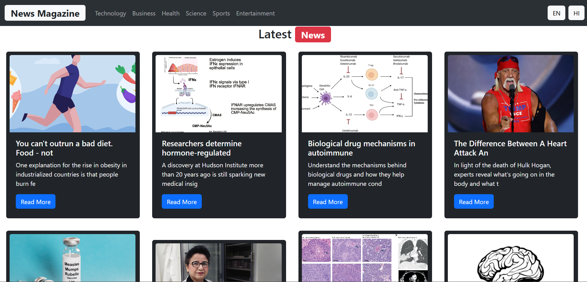
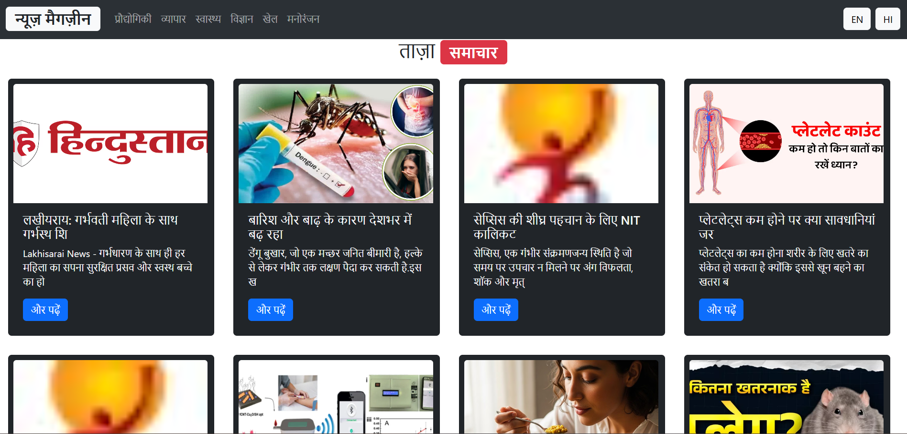

# News Magazine Web App

A modern news magazine web application built with **React, Vite, Bootstrap**, and **i18next** for multilingual support (currently Hindi & English). It fetches real-time news data using the **GNews API** and displays categorized headlines with a clean and responsive UI.

---

## Features
- **Real-time News:** Fetches top headlines by category (Technology, Sports, Business, etc.).
- **Multilingual Support:** Currently supports Hindi & English using `react-i18next`, with scalability for more languages in the future.
- **Responsive Design:** Built with Bootstrap for mobile-friendly UI.
- **Fallback Image Handling:** Displays a default image when no image is available.
- **Dynamic Categories:** Clickable navbar for different news categories.
- **Deployed on Vercel/Netlify** for fast and free hosting.

---

## Tech Stack
- **Frontend:** React (Vite)
- **Styling:** Bootstrap 5
- **Internationalization:** react-i18next, i18next
- **API:** GNews API
- **Deployment:** Vercel / Netlify

## Live Demo
[View Live Demo](https://news-magazine-4zw2ogoir-priyankas-projects-5a9bd4df.vercel.app)

## Screenshots

### Home Page (English)

### Home Page (Hindi)

